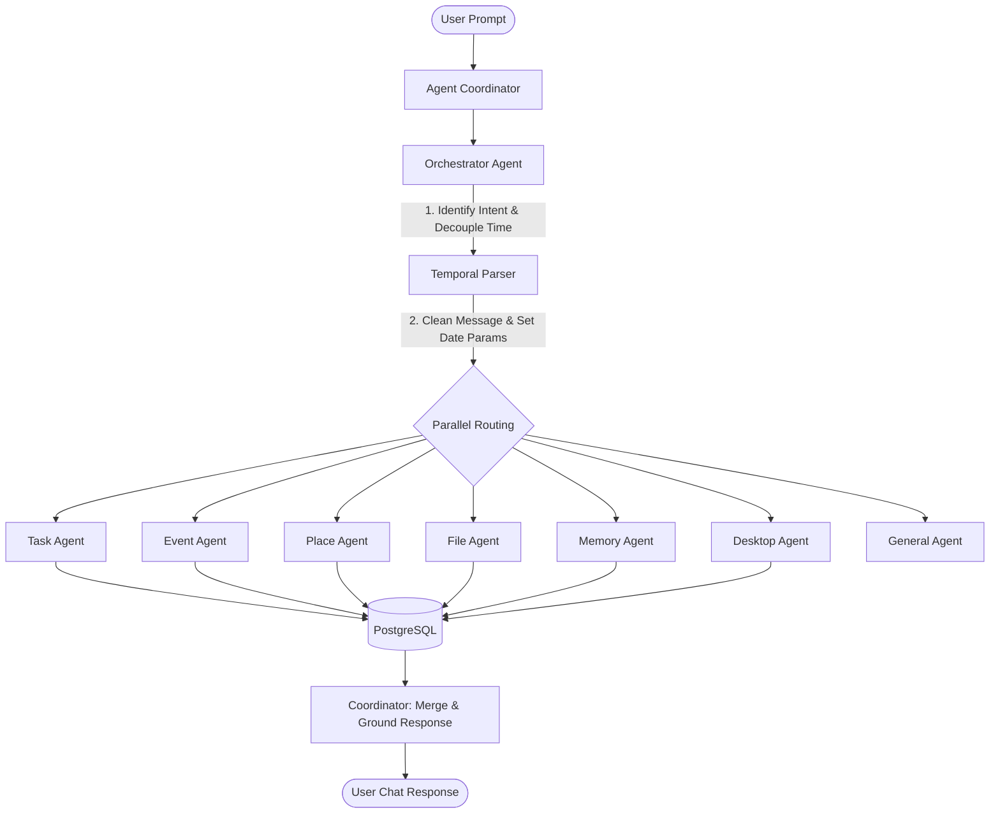

# Architectural Reference: Database Tables & Multi-Agent Systems

This reference document details the system's PostgreSQL database tables and the architecture of the specialized AI Agents.

---

## 1. Database Schema Reference

The PostgreSQL database maintains data integrity and powers the semantic search indices. Below is the mapping of all active tables.

### Core Tables

| Table Name        | Primary Key | Description                     | Key Columns                                                    |
| :---------------- | :---------- | :------------------------------ | :------------------------------------------------------------- |
| `users`           | `id` (UUID) | User accounts                   | `email`, `display_name`, `password`                            |
| `devices`         | `id` (UUID) | Desktop or mobile clients       | `user_id`, `name`, `device_type`, `platform`                   |
| `tasks`           | `id` (UUID) | Tasks with AI Smart Urgency     | `user_id`, `title`, `priority`, `due_at`, `status`, `quadrant` |
| `places`          | `id` (UUID) | Location landmarks              | `user_id`, `name`, `latitude`, `longitude`, `is_visited`       |
| `calendar_events` | `id` (UUID) | Calendar items                  | `user_id`, `place_id`, `title`, `starts_at`, `ends_at`         |
| `reminders`       | `id` (UUID) | Notifications schedules         | `user_id`, `task_id`, `event_id`, `trigger_at`, `dismissed_at` |
| `geofences`       | `id` (UUID) | Location-based triggers         | `place_id`, `reminder_id`, `radius_meters`, `is_active`        |
| `files`           | `id` (UUID) | Standard workspace file catalog | `user_id`, `path`, `name`, `extension`, `size_bytes`           |
| `conversations`   | `id` (UUID) | Chronological user/AI dialogues | `user_id`, `role`, `content`, `intent`, `entities`             |

### Collaboration & Tracking Tables

| Table Name            | Description                            | Key Columns                                   |
| :-------------------- | :------------------------------------- | :-------------------------------------------- |
| `projects`            | Team workspaces                        | `owner_id`, `name`, `description`, `status`   |
| `project_memberships` | User access roles to projects          | `project_id`, `user_id`, `role`               |
| `task_assignments`    | Task allocations                       | `task_id`, `assignee_id`, `assigned_by`       |
| `comments`            | Threaded discussions on tasks/projects | `user_id`, `project_id`, `task_id`, `body`    |
| `notifications`       | Internal push alerts                   | `user_id`, `type`, `title`, `body`, `read_at` |
| `tags`                | Categorization tags                    | `user_id`, `name`, `color`                    |
| `entity_tags`         | Dynamic tag bindings                   | `tag_id`, `entity_type`, `entity_id`          |
| `saved_views`         | Custom filter presets                  | `user_id`, `name`, `filters`, `sort_by`       |

### System & AI Intelligence Tables

| Table Name             | Description                                 | Key Columns                                                                                            |
| :--------------------- | :------------------------------------------ | :----------------------------------------------------------------------------------------------------- |
| `memory_embeddings`    | Semantic user memories                      | `user_id`, `content`, `embedding_json`, `metadata`                                                     |
| `document_embeddings`  | Deep document understanding chunks          | `user_id`, `file_path`, `content`, `embedding_json`, `entities`, `summary`, `file_type`, `chunk_index` |
| `entity_relationships` | Knowledge Graph adjacency matrix            | `user_id`, `from_entity_id`, `relationship_type`, `to_entity_id`, `weight`                             |
| `agent_metrics`        | Latency and token usage logging             | `agent_name`, `provider`, `model`, `latency_ms`, `tokens_used`                                         |
| `evaluation_logs`      | RAG quality auditing (Groundedness, Recall) | `user_id`, `query`, `groundedness_score`, `hallucination_risk`                                         |
| `retrieval_logs`       | Retrieval analytics logs                    | `user_id`, `query`, `source`, `result_count`, `latency_ms`                                             |
| `scheduled_jobs`       | Cron state tracking                         | `job_type`, `entity_id`, `scheduled_at`, `status`                                                      |

---

## 2. Multi-Agent System Architecture

The AI is powered by specialized agents that execute in parallel and coordinate via a central orchestrator.

### Agent Roles & Specifications

1. **Orchestrator Agent (`orchestrator.js`)**
   - **Role:** Central Router.
   - **Behavior:** Processes raw inputs, identifies target agents, detects temporal references (setting `needs_parsing: true`), and routes to target handlers without attempting math itself.

2. **Task Agent (`taskAgent.js`)**
   - **Role:** Task lifecycle controller.
   - **Behavior:** Parses priorities, titles, and checklist items. Supports `create`, `update`, `delete`, and `list` actions.

3. **Event Agent (`eventAgent.js`)**
   - **Role:** Calendar manager.
   - **Behavior:** Coordinates events, schedules starts/ends times, titles, locations, and checks conflicts.

4. **Place Agent (`placeAgent.js`)**
   - **Role:** Geo-spatial coordinator.
   - **Behavior:** Resolves locations, adds notes, tags geo-coordinates, and supports geofencing reminders.

5. **File Agent (`fileAgent.js`)**
   - **Role:** File index retrieval.
   - **Behavior:** Queries standard catalogs alongside the **Deep Document Understanding** vector index to surface file paths, text matches, extracted entities, and document summaries.

6. **Memory Agent (`memoryAgent.js`)**
   - **Role:** Episodic memory search.
   - **Behavior:** Stores and queries vector embeddings of user facts to recall background information.

7. **Desktop Agent (`desktopAgent.js`)**
   - **Role:** OS-level interface.
   - **Behavior:** Scans local directories recursively, reads PDFs/DOCXs/CSVs, parses text, and opens files natively on Windows (`exec start`).

8. **General Agent (`generalAgent.js`)**
   - **Role:** Conversational helper.
   - **Behavior:** Addresses questions, profiles queries, and manages fallback responses.
